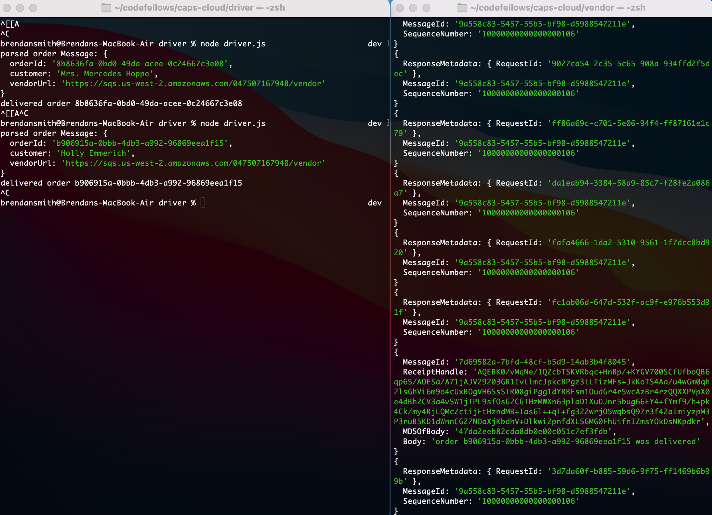
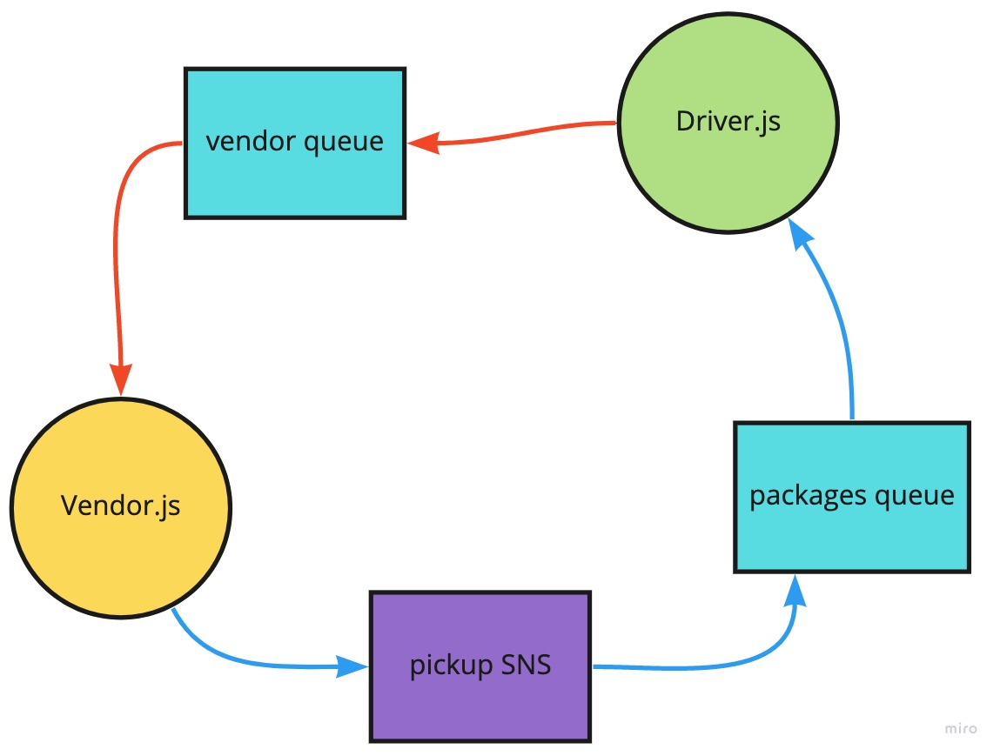

# LAB - Week 3

## Project: Caps-cloud

### Author: Brendan Smith

### Links and Resources

<!-- - [ci/cd](https://github.com/brendigler/caps/actions) -->
<!-- - [server url]() -->
- [pull request](https://github.com/brendigler/caps-cloud/pulls/1)

### Setup

#### `.env` requirements

- `VENDOR_ID` optional string
- `VENDOR_URL`optional string

#### How to initialize/run your application

- clone to local repo
- on each Vendor, Driver directory:
  - `npm install`
  - `npm start`

#### Tests

#### UML / Application Wiring Diagram

